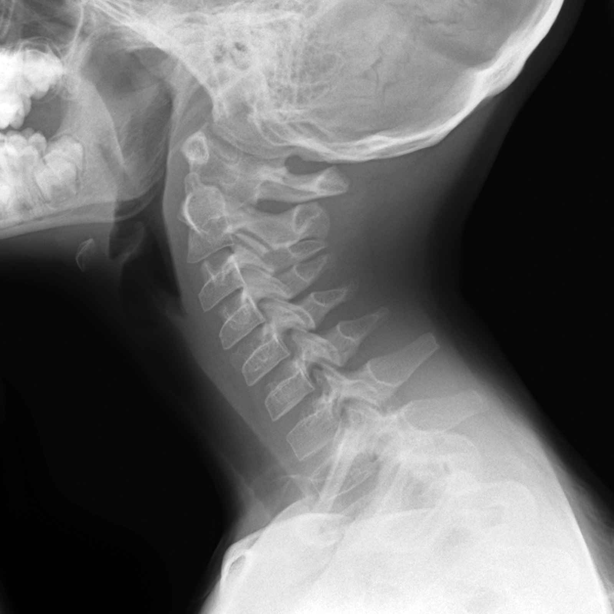
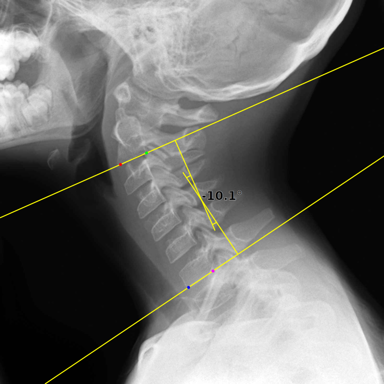

# C2C7 Angle Demo
Demo apps of C2C7 Cobb angle measure by AI presented in our paper (TBA).

Following two versions are available.

- [Web app](https://ykszk.github.io/c2c7demo/) for easy use.
- [Executable](https://github.com/yk-szk/c2c7demo/releases/latest) for more flexible uses.

## Web app

### Usage
- Open the [web app](https://ykszk.github.io/c2c7demo/)
- Drop a lateral radiograph of cervical spine. Jpeg and PNG input is supported while dicom is not very well tested.
  - [Google image search](https://www.google.com/search?q=cervical+spine+lateral+radiograph&tbm=isch)
- Click the measure button.
- Wait for 5 - 30 seconds.


|  Input  |  Result  |
| ---- | ---- |
|    |   |

[image attribution](tests/img/ATTRIBUTION.md)

## Executable
Command line programs.

- c2c7angle: Input one image and output one image.
- c2c7batch: Input a folder/directory, process all images in the input and output the results.

# Development

## Executable
Executable varsion is coded in rust. Some functions are exported as wasm for the web app version.

## Create ONNX model for the web app
The model needs to be compatible with WebGL backend.

1. Use `torch.onnx.export` to export to ONNX model
2. Apply `resize_align_corners.py` to change resize mode to align_corners. `pytorch_half_pixel` is not available in WebGL?
3. Apply [onnx-simplifier](https://github.com/daquexian/onnx-simplifier) to optimize away nodes unavailable in WebGL. e.g. `python -m onnxsim model.onnx simplefied.onnx --input-shape 2,1,768,768 --dynamic-input-shape`

(Note to myself) Do not add the model to the repository. Keep the repo lean.

Weights can be found in [google drive](https://drive.google.com/drive/folders/18Jet4hS7PALKxHSdak3nSURKlO06CLSU?usp=sharing).

## Tests
Download weights before running tests.
```sh
curl -L "https://drive.google.com/uc?export=download&id=1B1EeG38_WTZ42Qg-KlUpnThhEHJQDwkS" -o c2c7.onnx
```